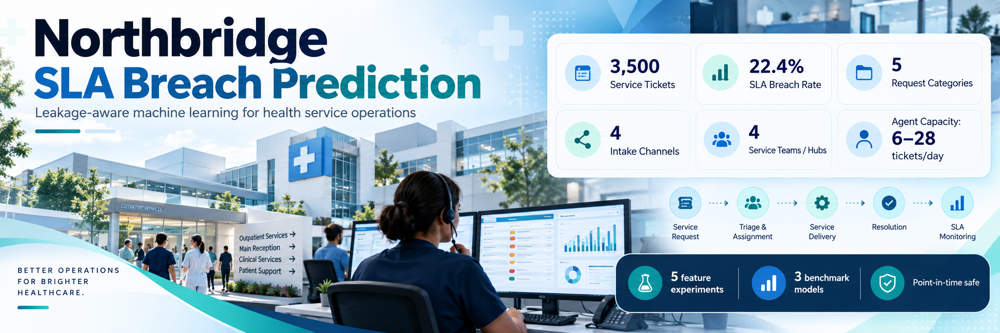
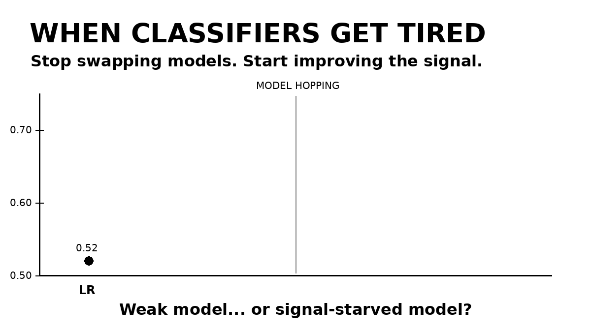
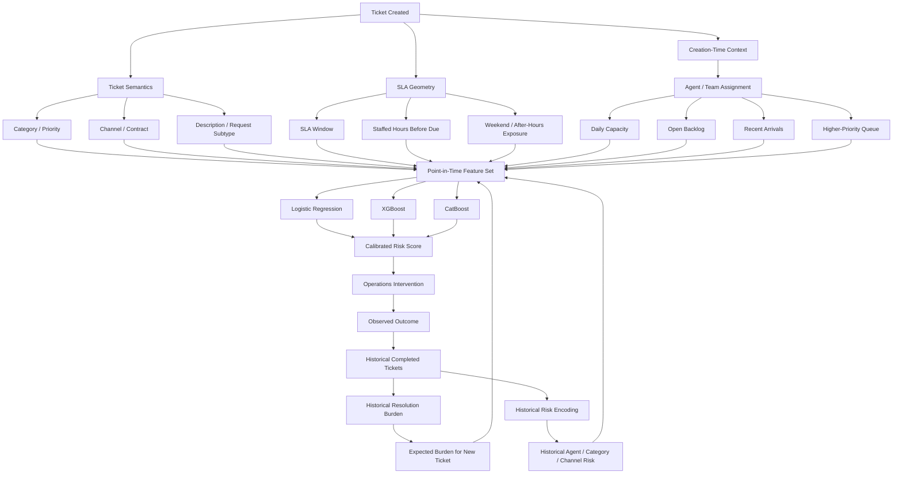
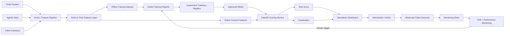
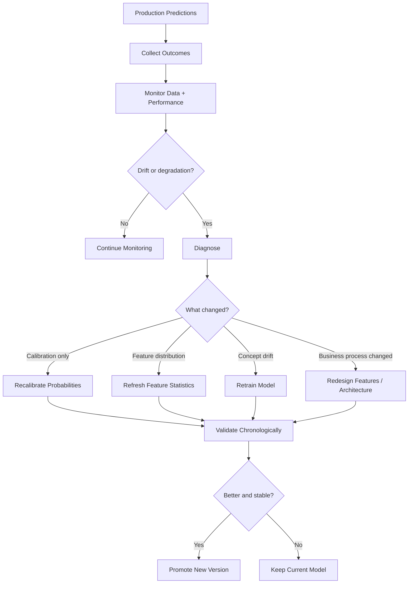

# Northbridge SLA Breach Prediction

> **When classifiers get tired, improve the signal architecture before adding another model.**

A leakage-aware machine learning project for predicting **Service Level Agreement (SLA) breaches** from operational support-ticket data.

The project goes beyond a simple “train a classifier” workflow. It treats SLA breach as a **time-dependent operational process** shaped by request complexity, available SLA time, queue pressure, agent capacity, historical resolution burden, and the evolving state of a ticket.

---

## Project theme

<!-- Replace the path below with the final project theme/banner image -->
<p align="center">
  
</p>

> **Theme image placeholder:** `assets/project_theme_placeholder.png`

---

## Visual project story

<!-- Replace the path below with the final GIF/animation -->
<p align="center">
  
</p>

> **Animation placeholder:** `assets/classifiers_get_tired_signal_engineering.gif`

Suggested caption:

> **Weak model — or signal-starved model?**  
> The project investigates the point where additional classifier tuning stops producing meaningful gains and feature-signal engineering becomes the real modelling problem.

---

# 1. Project overview

Northbridge handles service requests under contractual SLA commitments. Each ticket has characteristics such as:

- priority;
- request category;
- communication channel;
- contract tier;
- assigned team/agent;
- agent daily capacity;
- SLA credit clause;
- creation time;
- SLA due time;
- response and resolution lifecycle timestamps.

The business objective is to identify tickets that are likely to breach SLA **early enough for operations teams to intervene**.

The first modelling attempts achieved only weak discrimination, with ROC-AUC close to the low-0.50s despite XGBoost hyperparameter tuning.

That changed the project question from:

> **“Which classifier should we try next?”**

to:

> **“What part of the operational process has not yet been converted into predictive signal?”**

This repository develops that second question scientifically.

---

# 2. Business challenge

A ticket can breach SLA for several very different reasons:

- the request itself is difficult;
- the SLA window is unusually tight;
- the ticket arrives during low-staffed hours;
- the assigned agent/team is already overloaded;
- higher-priority cases are ahead in the queue;
- the request requires external approval, investigation or documentation;
- the ticket is repeatedly reassigned or escalated;
- historic patterns have changed because of staffing, demand or process drift.

This means SLA breach is not simply:

```text
Category + Priority + Team -> Breach
```

It is closer to:

```text
Expected work required
        +
Effective time available
        +
Current service pressure
        +
Resource capability
        +
Process evolution
        ->
Probability of SLA breach
```

---

# 3. Target

```text
Target: SLABreached
0 = resolved within SLA
1 = SLA breached
```

The positive class is moderately imbalanced, so accuracy alone is not an appropriate success metric.

Primary evaluation focuses on:

- ROC-AUC;
- PR-AUC / Average Precision;
- Recall;
- Precision;
- F1;
- Lift@K;
- Recall@K;
- Brier score;
- calibration.

---

# 4. Data sources

The project currently combines three operational tables.

| Dataset | Purpose | Example fields |
|---|---|---|
| `Tickets.csv` | Ticket lifecycle and outcome | CategoryID, PriorityID, Channel, CreatedAt, FirstResponseAt, ResolvedAt, SLADueAt, Status, ResolutionNotes, SLABreached |
| `Agents.csv` | Resource context | AgentID, TeamID, Hub, Role, Specialisms, DailyCapacity, IsActive |
| `Clients.csv` | Contract context | ClientID, ContractTier, SLACreditClause |

---


## Teaching notebooks

The notebooks are deliberately written as **elementary teaching thought-flows** rather than code-heavy scripts. Each section follows the same rhythm:

```text
plain-language question
-> minimal code
-> a few real rows / a compact table
-> interpretation
-> why it matters for leakage or model quality
```

| Notebook | Teaching focus |
|---|---|
| `01_data_ingestion_and_audit.ipynb` | business problem, joins, class imbalance, prediction timestamp and the time-machine leakage test |
| `02_eda_signal_discovery.ipynb` | EDA as a search for predictive separation, not decorative plotting |
| `03_feature_engineering_point_in_time.ipynb` | SLA geometry, queue pressure, historical burden, causal target encoding and description signals |
| `04_experiments_and_champion.ipynb` | chronological splitting, E1-E5 ablation, LR/XGBoost/CatBoost comparison and champion testing |
| `05_explainability_drift_and_serving.ipynb` | SHAP, drift, API serving and production monitoring |

# 5. Core leakage rule

The entire architecture follows one rule:

> **A feature is valid only if its value would have been known at the exact prediction timestamp.**

This is the project's “time-machine test”.

## Directly prohibited at ticket creation

The following are useful for retrospective analysis but must not be supplied directly to a T0/T1 model:

```python
LEAKAGE_COLUMNS = [
    "FirstResponseAt",
    "ResolvedAt",
    "Status",            # final status
    "ResolutionNotes",
    "SLABreached",       # target
]
```

`SLADueAt` is treated separately:

- if it is generated at ticket creation, the **SLA window** is legitimate;
- if it is assigned later, it must be excluded from earlier models.

Agent-level features are also allowed only if the agent is already assigned at the prediction point.

---

# 6. Scientific modelling architecture

Instead of one monolithic model, the project separates the business process into interpretable signal layers.



---

# 7. Why `CategoryID` is not forced to be ordinal

The five categories represent different request families rather than increasing levels of the same variable.

Examples include:

- appointment administration;
- billing/invoice queries;
- pre-authorisation requests;
- formal complaints;
- document requests.

Therefore:

```text
Category 5 > Category 4
```

has no intrinsic mathematical meaning.

Instead, this project learns a separate **historical resolution-burden signal** from completed tickets.

This preserves:

```text
CategoryID = nominal request family
```

while separately estimating:

```text
ExpectedResolutionBurden = how difficult similar requests historically were
```

---

# 8. Resolution burden

Historical completed cases can tell us how much work or process complexity similar tickets usually require.

Candidate burden signals include:

```text
CreatedAt -> FirstResponseAt
FirstResponseAt -> ResolvedAt
CreatedAt -> ResolvedAt
```

plus structured themes extracted from `ResolutionNotes`, for example:

- investigation;
- external-party dependency;
- insurer/client involvement;
- approval;
- financial correction;
- documentation;
- escalation;
- corrective action;
- multiple actions/hand-offs.

Important:

> `ResolutionNotes` is a **teacher**, not a predictor for the current ticket.

It is used to learn historical burden patterns from old completed cases.

The current ticket receives only a frozen, leakage-safe estimate such as:

```text
ExpectedBurden(Category, Channel, RequestSubtype)
```

---

# 9. Signal architecture

The current feature strategy is organised into five groups.

| Signal layer | Examples | Business meaning |
|---|---|---|
| Ticket semantics | Priority, Category, Channel, ContractTier, Description | What type of work is arriving? |
| SLA exposure | SLAWindowHours, staffed hours, deadline time/day | How much usable time is available? |
| Service pressure | backlog, arrivals, urgent queue, queue/capacity ratio | How busy is the service operation? |
| Historical capability | Agent×Category history, Category×Channel risk | How has similar work historically performed? |
| Resolution burden | historical cycle time, note-derived complexity | How difficult is similar work likely to be? |

---

# 10. Feature engineering examples

## Time geometry

Clock time is cyclical.

```python
hour_sin = sin(2 * pi * created_hour / 24)
hour_cos = cos(2 * pi * created_hour / 24)
```

The same treatment can be used for day-of-week.

## Effective SLA time

A raw 24-hour SLA is not always equivalent to 24 staffed operational hours.

Candidate features:

```text
SLAWindowHours
StaffedHoursBeforeDue
AfterHoursFraction
DueOnWeekend
HoursUntilNextShift
DeadlineHour
DeadlineDay
```

## Queue pressure

More informative than raw DailyCapacity alone:

```text
AgentOpenBacklog
TeamOpenBacklog
HigherPriorityOpenCases
CasesDueBeforeThisTicket
RecentArrivals_1h
RecentArrivals_4h
AgentBacklogPerCapacity
TeamBacklogPerCapacity
WeightedQueuePressure
```

## Historical target/risk encoding

Potential encodings include:

```text
P(Breach | AgentID)
P(Breach | AgentID, CategoryID)
P(Breach | CategoryID, Channel)
P(Breach | PriorityID, ContractTier)
```

These must be calculated using **past tickets only**.

A smoothed version is:

```text
HistoricalRisk =
(PastBreaches + alpha * GlobalPastBreachRate)
/
(PastCases + alpha)
```

This prevents tiny groups from producing unstable risk estimates.

---

# 11. Class imbalance

Northbridge's breach class is imbalanced, but not so extreme that synthetic oversampling should automatically be the default.

The project therefore prioritises:

1. class-weighted Logistic Regression;
2. `scale_pos_weight` for XGBoost;
3. CatBoost balanced class weights;
4. threshold selection based on operational capacity;
5. PR-AUC and lift-based evaluation.

SMOTE remains an experiment, not a default assumption.

---

# 12. Model experiments

The notebook is deliberately structured as an **ablation study**.

Each experiment introduces one new business mechanism so changes in performance can be attributed to the added information rather than random model complexity.

## Core experiment matrix

| Experiment | Added information | Logistic Regression | XGBoost | CatBoost |
|---|---|:---:|:---:|:---:|
| E1 | Clean static baseline | ✓ | ✓ | ✓ |
| E2 | SLA + time geometry | ✓ | ✓ | ✓ |
| E3 | Service pressure | ✓ | ✓ | ✓ |
| E4 | Historical resolution burden | ✓ | ✓ | ✓ |
| E5 | Full burden × SLA × pressure architecture | ✓ | ✓ | ✓ |

## Planned/extended experiments

| Experiment | Research question |
|---|---|
| E6 | Does leakage-safe target encoding improve historical signal? |
| E7 | Does Random Forest / Extra Trees reveal nonlinear interactions missed elsewhere? |
| E8 | Does initial ticket text/Description provide stronger semantic signal? |
| E9 | Does a survival/time-to-resolution formulation outperform direct classification? |
| E10 | Does in-flight lifecycle re-scoring materially improve risk detection? |

---

# 13. Current modelling lesson

Early experiments show that simply moving from Logistic Regression to increasingly powerful classifiers does not automatically solve the problem.

Observed behaviour has included ROC-AUC remaining close to weak discrimination despite additional model complexity.

That is treated as an important scientific result:

> **The limiting factor may be feature signal, not classifier capacity.**

The project therefore prioritises:

```text
signal quality
>
model complexity
```

and:

```text
temporal validity
>
optimistic cross-validation score
```

---

# 14. Multi-stage predictive process design

SLA risk evolves as a ticket moves through the workflow.

A production system should therefore eventually use several legal prediction points.

| Model | Prediction moment | Information allowed |
|---|---|---|
| T0 | Ticket creation | ticket semantics, contract, channel, SLA geometry |
| T1 | Agent/team assignment | T0 + agent capacity + queue state + agent history |
| T2 | First response | T1 + actual response delay + SLA time consumed |
| T3 | In-flight monitoring | current status, hand-offs, elapsed time, remaining SLA |

This solves a common leakage problem elegantly:

```text
FirstResponseAt
```

is illegal at T0 but completely legitimate at T2 because it has already happened.

---

# 15. Evaluation philosophy

The project does not treat `0.50` as a universal decision threshold.

For operations, the relevant question is often:

> If Northbridge can intervene on only the highest-risk 10% of tickets, how many eventual breaches can be captured?

Recommended metrics:

```text
ROC-AUC
PR-AUC
Precision@5%
Precision@10%
Precision@20%
Recall@5%
Recall@10%
Recall@20%
Lift@10%
Brier Score
Calibration Error
```

---

# 16. Explainability

Explainability is required at three levels.

## Global

What generally drives SLA breach?

Examples:

```text
ExpectedResolutionBurden
WeightedQueuePressure
EffectiveSLAHours
Priority
AgentCategoryHistoricalRisk
```

Methods:

- Logistic Regression coefficients;
- SHAP global importance;
- partial dependence / ALE where appropriate.

## Segment

Are risk mechanisms different by:

- Category;
- Channel;
- Contract tier;
- Team;
- Agent;
- time period?

## Ticket-level

An operator should receive a reason such as:

```text
High breach risk because:
- expected resolution burden is above normal;
- only 5.2 staffed SLA hours remain;
- assigned agent has a high active backlog;
- 7 higher-priority tickets are due sooner.
```

The goal is actionable explanation, not merely feature importance.

---

# 17. Tech stack

## Current modelling stack

| Layer | Technology |
|---|---|
| Language | Python |
| Data manipulation | pandas, NumPy |
| Statistical / baseline ML | scikit-learn |
| Gradient boosting | XGBoost |
| Categorical boosting | CatBoost |
| Visualisation | Matplotlib |
| Notebook development | Jupyter |

## Target production stack

| Layer | Candidate technology |
|---|---|
| Experiment tracking | MLflow |
| API serving | FastAPI |
| Containerisation | Docker |
| Cloud deployment | AWS |
| Explainability | SHAP |
| Data / model monitoring | Evidently, whylogs or custom monitoring |
| Feature consistency | point-in-time feature pipeline / optional Feast |
| Orchestration | scheduled pipeline / workflow orchestrator |
| Version control | Git + GitHub |

The production tools above represent the target deployment architecture and can be introduced incrementally.

---

# 18. Deployment architecture



---

# 19. Scalability principles

The current dataset can be handled comfortably in-memory, but the architecture is designed to scale.

### Event-based data

Store lifecycle changes as timestamped events:

```text
TicketCreated
AgentAssigned
StatusChanged
FirstResponse
Reassigned
Escalated
Resolved
```

rather than relying only on the final ticket row.

### Point-in-time correctness

Every historical training row must reconstruct exactly what the system knew at that time.

### Training-serving consistency

The same feature definitions should be used in:

```text
offline training
and
online prediction
```

to avoid training-serving skew.

### Modular models

T0, T1, T2 and T3 models can be deployed independently.

---

# 20. Monitoring architecture

The production model should monitor more than ROC-AUC.

| Monitoring layer | What to track | Example warning |
|---|---|---|
| Data quality | missingness, invalid values, schema | DailyCapacity becomes null |
| Input drift | feature distributions | Channel mix shifts toward Portal |
| Operational drift | workload/capacity | team backlog doubles |
| Prediction drift | score distribution | mean risk changes 0.21 -> 0.35 |
| Performance drift | ROC-AUC, AP, Lift@K | ranking ability declines |
| Calibration drift | predicted vs observed risk | 20% scores now breach 35% |
| Segment drift | metrics by category/team/channel | Category 5 performance collapses |
| Explanation drift | SHAP distributions | queue pressure becomes dominant |

---

# 21. Retraining strategy

Retraining should be triggered by evidence, not simply by a calendar.



---

# 22. Validation strategy

Random train/test splitting is not the default for this problem.

The recommended validation design is expanding-window temporal validation:

```text
Fold 1:
Train Jan-Apr -> Validate May

Fold 2:
Train Jan-May -> Validate Jun

Fold 3:
Train Jan-Jun -> Validate Jul

Fold 4:
Train Jan-Jul -> Validate Aug

Final:
Untouched future test period
```

Within each fold, the following must be learned only from training history:

- imputation;
- scaling;
- target encoding;
- historical burden;
- historical breach rates;
- text vocabulary;
- feature selection;
- calibration;
- thresholds.

---

# 23. Key challenges and ML responses

| Business / ML challenge | Risk | Northbridge solution |
|---|---|---|
| Weak static signal | AUC remains near chance | reconstruct business-process features |
| Future lifecycle fields | severe target leakage | prediction-time feature gating |
| Moderate class imbalance | misleading accuracy | PR-AUC, weighting, Lift@K |
| Arbitrary CategoryID order | false ordinal relationship | nominal category + learned burden |
| Raw DailyCapacity | lacks workload context | backlog/capacity ratios |
| Final Status | post-outcome leakage | timestamped status events in future architecture |
| ResolutionNotes | future information | use old notes to learn burden only |
| Agent heterogeneity | hidden performance differences | causal Agent×Category history |
| Changing workload/process | concept drift | rolling monitoring + retraining |
| Black-box risk scores | low operational trust | SHAP + business-readable reasons |
| Training-serving skew | inconsistent predictions | shared point-in-time feature definitions |
| Weak one-time prediction | misses evolving risk | T0-T3 lifecycle re-scoring |

---

# 24. Repository structure

```text
northbridge-sla-breach/
|
├── README.md
├── requirements.txt
├── .gitignore
|
├── assets/
│   ├── northbridge_project_theme.png
│   └── classifiers_get_tired_signal_engineering.gif
|
├── data/
│   ├── raw/
│   │   ├── Tickets.csv
│   │   ├── Agents.csv
│   │   └── Clients.csv
│   └── processed/
|
├── notebooks/
│   ├── 01_data_ingestion_and_audit.ipynb
│   ├── 02_eda_signal_discovery.ipynb
│   ├── 03_feature_engineering_point_in_time.ipynb
│   ├── 04_experiments_and_champion.ipynb
│   └── 05_explainability_drift_and_serving.ipynb
|
├── src/
│   ├── data/
│   │   ├── load.py
│   │   └── validation.py
│   ├── features/
│   │   ├── time_features.py
│   │   ├── queue_features.py
│   │   ├── burden_features.py
│   │   └── target_encoding.py
│   ├── models/
│   │   ├── train.py
│   │   ├── evaluate.py
│   │   └── calibrate.py
│   └── monitoring/
│       ├── drift.py
│       └── performance.py
|
├── app/
│   └── main.py
|
├── models/
├── reports/
└── tests/
```

---

# 25. Project roadmap

- [x] Establish leakage-aware prediction boundary
- [x] Benchmark Logistic Regression and gradient-boosted classifiers
- [x] Investigate Category / Channel / Capacity signal
- [x] Define historical resolution-burden architecture
- [x] Design causal service-pressure features
- [x] Establish chronological experiment framework
- [ ] Add Description / request-subtype signal
- [ ] Add leakage-safe target encoding
- [ ] Benchmark Random Forest / Extra Trees
- [ ] Test survival / time-to-resolution modelling
- [ ] Add SHAP explanations
- [ ] Add probability calibration
- [ ] Build FastAPI inference service
- [ ] Containerise with Docker
- [ ] Add MLflow experiment tracking
- [ ] Implement drift monitoring
- [ ] Implement automated retraining gates
- [ ] Deploy operations dashboard

---

# 26. Project philosophy

This project is built around a simple observation:

> **A stronger classifier cannot recover information that the feature architecture does not contain.**

When performance plateaus, the next question should not automatically be:

```text
What model should I try next?
```

It should be:

```text
What part of the real process is still invisible to the model?
```

For Northbridge, that means moving from static ticket classification toward **leakage-aware predictive process monitoring**.

```text
Creation
   ->
Assignment
   ->
First Response
   ->
In-Flight Monitoring
   ->
Resolution
```

The objective is not merely to predict breach.

It is to identify **why risk is building early enough for someone to do something about it**.

---

## Author / Project status

**Project:** Northbridge SLA Breach Prediction  
**Status:** Active research and development  
**Focus:** Feature-signal engineering, leakage-aware ML, predictive process monitoring, explainability and MLOps

---

## License

Add the appropriate repository license here.

```text
Example:
MIT License
```


---

# End-to-end runnable repository

## Quick start

```bash
python -m venv .venv
source .venv/bin/activate        # Windows: .venv\\Scripts\\activate
pip install -r requirements-dev.txt
python scripts/copy_local_data.py --source /path/to/source/files
python scripts/run_pipeline.py
pytest -q
```

Start the API and dashboard locally:

```bash
uvicorn services.api.main:app --reload --port 8000
python services/dashboard/app.py
```

Or start the service stack:

```bash
docker compose up --build
```

Then open:

- Reverse proxy / dashboard: `http://localhost:8080/dashboard/`
- API health: `http://localhost:8080/api/health`
- API verification: `http://localhost:8080/api/verify`
- API docs: `http://localhost:8080/api/docs`
- MLflow: `http://localhost:5000/`

> Raw CSV files are deliberately excluded from Git. See `data/raw/README.md`.


## Example prediction request

```bash
curl -X POST http://localhost:8000/predict \
  -H "Content-Type: application/json" \
  --data @services/api/sample_request.json
```

Model integrity can be checked with:

```bash
curl http://localhost:8000/verify
```

## Retraining gate

```bash
python scripts/retrain_if_needed.py
# add --execute only after reviewing the trigger and challenger validation
```

The gate distinguishes *monitoring evidence* from *model promotion*: a retraining trigger starts a new controlled experiment; it does not automatically replace the champion.
