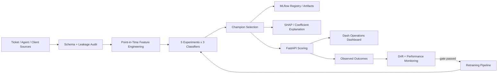

# Architecture

## Principle

Every feature must carry a prediction-time contract: **when was this value actually knowable?**

## Prediction points

- **T0**: ticket creation.
- **T1**: immediately after agent/team assignment — current production target in this repository.
- **T2**: first response.
- **T3**: in-flight re-scoring.

A field can be leakage at T0 but legal at T2. The timestamped process state, not the column name alone, determines legality.
